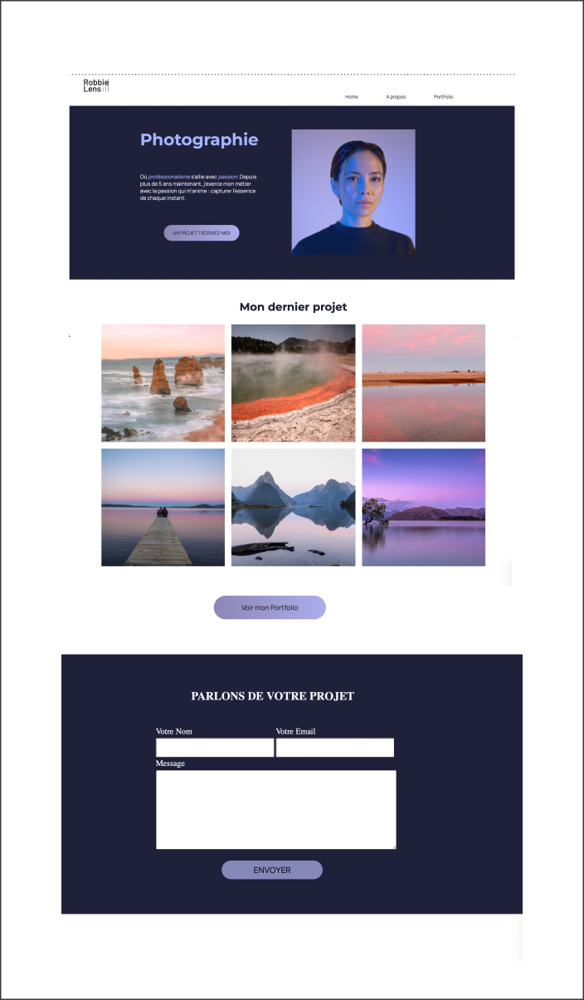

# Html-Css-Portfolio

image.png

This is a full project with basics html - css
I have build a Portfolio of a professional photograph.
This is an exercice to use flexbox and grid with em and % values.

